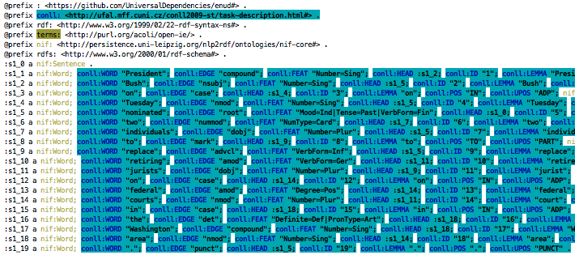
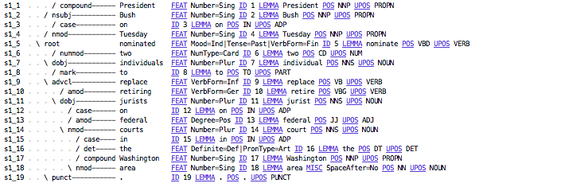

# CoNLL-RDF
__conll-rdf__ is a tool for converting between formats of annotated linguistic corpora and annotations, as well as linking and enriching these with external ontologies.  
It consists of a number of JAVA modules which can be chained to construct a data processing pipeline. 

CoNLL-RDF can read and write any annotation format that fulfills the following criteria:
* tab-separated columns (TSV format, i.e., [CSV](https://datatracker.ietf.org/doc/html/rfc4180) with TAB as separator)
* every row represents one unit of annotation (e.g., a word) along with its annotations
* every column represents one type of annotation (e.g., string form, lemma, parts-of-speech, ...)
* empty lines as sentence separators (optional) 
* comments and headlines marked by `#` (optional)

## Contents

  * [What it can do](#what-it-can-do)
  	* [How it works](#how-it-works)
  	* [Installing](#installing)
  	* [Getting Started](#getting-started)
  	* [Features](#features)
  * [Troubleshooting](#troubleshooting)
  * [Acknowledgments](#acknowledgments)
	  * [Authors and Maintainers](#authors-and-maintainers)
	  * [License](#license)
	  * [How to Cite](#how-to-cite)

## What it can do
* convert _any_ CoNLL-like TSV format (e.g. `.conll`, `.conllu`, `.tsv`, `.skel`) to conll-rdf (`.ttl`).
* perform SPARQL Updates on conll-rdf data.
* visualize conll-rdf structure.
* convert conll-rdf back to (any) CoNLL format.

In particular, it serves as a ***generic converter*** between various CoNLL/TSV formats. For doing so, it requires the user to provide column labels. Also see [CoNLL-Transform](https://github.com/acoli-repo/conll-transform) for an effort on _automated_ transformation and transformation validation on this basis.

### How it works
In general, we read data line by line from `stdin`, process it and write results to `stdout`.  
For quick set-up, we recommend using `.sh` scripts to pipe your data through the tools.  
Each pipeline element can be called via `./run.sh $CLASS [args]`.  

Another method is to configure the pipeline in a config-json and call the entire pipeline with `./run.sh CoNLLRDFManager -c $config-json`.

Of course you can also use the provided classes within java as any other library.

### Installing
Download the repository from GitHub: `git clone https://github.com/acoli-repo/CoNLL-RDF.git`.
Then use `git submodule update --init --recursive` to clone the fintan-core submodule.

The project needs to be compiled once by running the `./compile.sh` bash script, which creates a stand-alone jar in the `target/` folder, and also installs conll-rdf into the local maven repo.

It compiles automatically whenever you run the tool via the `./run-via-maven.sh` bash script, which is meant mainly for quick development and doesn't package the jar. (Read the comments in the file for more info.)

You can manually (re)compile conll-rdf by calling the `./compile.sh` script or by using maven directly with `mvn clean package` from the project root.

#### Requirements
* Apache Maven (Latest release recommended. Expected to work from 3.3+).
  * run `mvn -version` to check if Maven is installed.
  * Maven will use the JDK in your JAVA_HOME system variable, so the java version listed here can differ from the one in your PATH.
* JDK (OpenJDK or Java SE), version 1.8 or higher.
  * run `java -version` to check if java is installed and in your PATH.
  * run `javac -version` to check if your version of the compiler is sufficient.

### Getting Started
All relevant classes are in [src/](./src/org/acoli/conll/rdf). Documentation for them is found in [doc/](doc/).

A [hands-on tutorial](./examples/README.md) with a variety of sample-pipelines, which you can adapt to your needs, can be found in [examples/](./examples). These convert data found in [data/](./data/ud/UD_English-master).

In case your corpus directly corresponds to a format found there you can directly convert it with given scripts into conll-rdf.

#### Example
Suppose we have a corpus `example.conll` and want to convert it to conll-rdf to make it compatible with a given LLOD technology. We can do this with a simple shell-command:

```shell
cat example.conll | ./run.sh CoNLLStreamExtractor my-baseuri.org/example.conll# \
    ID WORD LEMMA POS_COARSE POS FEATS HEAD EDGE > example.ttl
```

This will create a new file `example.ttl` in conll-rdf by simply providing

* a base-URI (ideally a resolvable URL to adhere to the five stars of LOD).
* the names of the CoNLL columns from left to right.

#### run.sh
`run.sh` is a wrapper script to make things feel more bash-like. It runs the specified java class with the provided arguments.
* eg. `cat foo.ttl | ./run.sh CoNLLRDFFormatter > foo_formatted.ttl` would pipe `foo.ttl` through `CoNLLRDFFormatter` into `foo_formatted.ttl`.
* `run.sh`, will not compile java classes. Run `compile.sh` in advance, or swap in `rin-via-maven.sh`, which does.

### Features
In-depth information on all the classes of **conll-rdf** can be found in [the documentation.](doc/classes.md)

IMPORTANT USAGE HINT: All given data is parsed sentence-wise (if applicable). Meaning that for CoNLL data as input a newline is considered as a sentence boundary marker (in regard to the CoNLL data model). The ID column (if present) must contain sentence internal IDs (if this is not the case this column must be renamed before conversion/parsing) - if no such column is provided sentence internal IDs will be generated. Please refer to the paper mentioned below under Reference.

#### CoNLLRDFManager
`CoNLLRDFManager` processes a pipeline provided as JSON.  
Synopsis: `CoNLLRDFManager -c [JSON-config]`

#### CoNLLStreamExtractor
`CoNLLStreamExtractor` expects CoNLL from `stdin` and writes conll-rdf to `stdout`.  
Synopsis: `CoNLLStreamExtractor baseURI FIELD1[.. FIELDn] [-s SPARQL_SELECT]`

#### CoNLLRDFUpdater
`CoNLLRDFUpdater` expects conll-rdf from `stdin` and writes conll-rdf to `stdout`. It is designed for updating existing conll-rdf files and is able to load external ontologies or RDF data into separate Graphs during runtime. This is especially useful for linking CoNLL-RDF files to other ontologies.  
It can also output `.dot` graph-files (or triples `stdout`).  
Synopsis: `CoNLLRDFUpdater -custom [-model URI [GRAPH]] [-updates [UPDATE]]`

`CoNLLRDFUpdater` allows to perform graph rewriting using SPARQL update scripts. Note that in addition to standard SPARQL 1.1 features (pattern matching, property paths, regular expressions), we support the following extensions:

- special functions for iterations over lists, splitting and manipulating strings ([from Apache Jena](https://jena.apache.org/documentation/query/library-propfunc.html))
- iterations (loops) over SPARQL Updates (note that this makes our usage of SPARQL [Turing-complete](https://arxiv.org/pdf/2004.01816.pdf))

#### CoNLLRDFFormatter
`CoNLLRDFFormatter` expects conll-rdf in `.ttl` and writes to different formats. Can also visualize your data.  
Synopsis: ```CoNLLRDFFormatter [-rdf [COLS]] [-debug] [-grammar] [-semantics] [-conll COLS] [-query SPARQL]```

It can write:
* canonical conll-rdf as `.ttl`.
* `.conll` of specified columns.
* TSV to `stdout` based on a given sparql select query.
* `debug` highlighted `.ttl` to `stderr`, e.g. highlighting triples representing conll columns or sentence structure differently.
>   
> Example from universal dependencies.
* `grammar`: writes conll data structure in tree-like format to `stdout`. (`/` resp. `\` are pointing in direction of `conll:HEAD`)
>   
> Example from universal dependencies.
* `semantics` seperate visualization of object properties of `conll:WORD` using `terms:` namespace, useful for visualizing knowledge graphs. **`EXPERIMENTAL`**

#### CoNLLRDFAnnotator
* can be used to manually annotate / change annotations in .ttl files.
* will visualize input just like `CoNLLRDFFormatter -grammar`. Will not make in-place changes but write the changed file to `stdout` (e.g. `./run.sh CoNLLRDFAnnotator file_old.ttl > file_new.ttl`)
	* **Note**: Make sure that input file (`file_old.ttl`) and output file (`file_new.ttl`) are **different**. Piping output into old file in this way is **not** supported (by your operating system)! Will result in data loss.

#### Other
* `CoNLL2RDF` contains the central conversion functionality. For practical uses, interface with its functionality through CoNLLStreamExtractor. Arguments to CoNLLStreamExtractor will be passed through.
* `CoNLLRDFViz` is an auxiliary class for the future development of debugging and visualizing complex SPARQL Update chains in their effects on selected pieces of CoNLL(-RDF) data
* conll-rdf assumes UTF-8.

## Troubleshooting

If you observe one of the problems below, see here for explanations and solutions. If this doesn't help, see [issues](https://github.com/acoli-repo/conll-rdf/issues) for similar problems and possible solutions. If you find none, please consider submitting an issue yourself and provide data snippets for replication.

* *during installation*
	* maven doesn't find/use the correct java installation
		* **solution**: [try setting your JAVA_HOME](https://www.baeldung.com/maven-different-jdk)
* *running pipelines*
	* your pipelines broke with an update in 2020-09 or soon after
		* **explanation**: you're likely calling the classes directly with `java`and not via `./run.sh`. 
		* **solution**: You can change your scripts to call `./run.sh` (or copy the changes we made to `run.sh` into your scripts).
	* an error like `bash: ./../test.sh: Permission denied` when trying to run a script
		* **explantion**: need execution rights
		* **explanation**: Use this command to change the filemode: `$> chmod +x <SCRIPT>`
	* an error starting like `ERROR CoNLLRDFUpdater :: SPARQL parse exception for Update No. 0: DIRECTUPDATE [...]` when running the RDFUpdater
		* **possible explanation**: in most cases, path to a SPARQL query is wrong
		* **solution**: Check for extra or missing `../`.
* *processing external data* (i.e., not produced by this library):
	* an error like `org.apache.jena.riot.RiotException: [line: 3, col: 12] Undefined prefix: rdfs` from CoNLLRDFUpdater even though the namespace in question is defined in the input
		* **possible explanation**: the data uses SPARQL-style prefix declarations 
		* **solution**: Make sure to use RDF 1.0 Turtle notation for prefixes (i.e., `@prefix bla: <...> .`), not the SPARQL-style notation (i.e., `PREFIX bla: <...>`) introduced with RDF 1.1 (cf. [issue #80](https://github.com/acoli-repo/conll-rdf/issues/80)). 
	* CoNLLRDFUpdater does not seem to get and process the expected matches, but execution of SPARQL Updates against a database backend works as expected.
		* **possible explanation**: This can be a segmentation issue in the original data. For every empty or comment (`#`) line in the input, CoNLLRDFUpdater will split the input into chunks and process each chunk in parallel. Some Turtle formatters will insert empty lines between groups of triples that do not relate to the same subject, and, then, CoNLLRDFUpdater will process these groups in isolation, so that context matches are being disabled. 
		* **solution**: Remove all empty lines and comments before feeding the input into CoNLLRDFUpdater:

				$> cat my-input.ttl | egrep '[^\s]' | grep -v '^#' | run.sh CoNLLRDFUpdater ...
			
			As a side-effect, this will disable parallelization. 
		* **solution**: If the solution above is not possible (e.g., because you're processing large-scale data), you can try to run CoNLLRDFUpdater over a sliding context window of, say, 10 chunks per direction:
	
				$> cat my-input.ttl | run.sh CoNLLRDFUpdater -lookahead 10 -lookback 10 ...
			
			Note that preceding and following context reside in separate named graphs [`https://github.com/acoli-repo/conll-rdf/lookback` and `https://github.com/acoli-repo/conll-rdf/lookahead`], so that your SPARQL updates must be adjusted, e.g., by importing these named graphs into the default graph. As a side-effect, this can lead to repetitions in the generated output.
		* **solution**: If neither of these options are applicable, it is necessary to segment the input properly before feeding it into CoNLL-RDF.
* *CoNLL export* with CoNLLRDFFormatter
	* CoNLLRDFFormatter `-conll` outputs CoNLL data out of order
		* **possible explanation**: The ordering algorithm requires all CoNLL words to be linked by `conll:HEAD+` with the sentence object. This can happen if a word does not have a `conll:HEAD` property or if its value if not the URI of a `nif:Sentence`. If the `conll:HEAD` property is missing or contains a literal (`0` or `_` instead of, say, `:s525_0`), this is the likely result (cf. [issue #50](https://github.com/acoli-repo/conll-rdf/issues/50))
		* **solution**: Make sure every word has a single `conll:HEAD` property, that these URIs correspond to words and sentences, and that the root elements point to the sentence URI. If this is the case, check whether the words are connected by `nif:nextWord`. 
	* an `org.apache.jena.query.QueryParseException` from CoNLLRDFFormatter with `-conll`
		* **explanation**: Certain punctuation symbols in column names/conll properties (e.g., `-`) can break the internal query generation. 
		* **solution**: Use only `[A-Za-z_]+` for CoNLL column labels.

## Acknowledgments

CoNLL-RDF has been created at the Applied Computational Linguistics ([ACoLi](http://acoli.cs.uni-frankfurt.de)) Lab at Goethe University Frankfurt, Germany.

With support from the following projects:

* Linked Open Dictionaries ([LiODi](http://www.acoli.informatik.uni-frankfurt.de/liodi/))
  * funded by the German Federal Ministry of Education and Research (BMBF, 2015-2022, grant agreement 01UG1631)
  * initial design and implementation; use case resource transformation and linking
* Specialised Information Service Linguistics ([FID](https://www.ub.uni-frankfurt.de/projekte/fid-linguistik_en.html))
  * funded by the German Research Foundation (DFG, 2017-2022, grant agreement CH1413/2-1)
  * use case: indexing and classifying CoNLL corpora
* QuantQual@CEDIFOR ([QuantQual](http://acoli.cs.uni-frankfurt.de/projects.html#quantqual))
  * funded by the Centre for the Digital Foundation of Research in the Humanities, Social and Educational Science (CEDIFOR, grant agreement 01UG1416A)
  * use case: linguistic annotation with CoNLL-RDF
* Prêt-á-LLOD. Ready-to-use Multilingual Linked Language Data for Knowledge Services across Sectors ([Pret-a-LLOD](https://cordis.europa.eu/project/id/825182/results))
  * Research and Innovation Action of the H2020 programme (ERC, grant agreement 825182)
  * In this project, CoNLL-RDF has been applied/developed/restructured to serve as backend of the Flexible Integrated Transformation and Annotation Engineering ([FINTAN](https://github.com/Pret-a-LLOD/Fintan)) Platform.

### Authors and Maintainers
* **Christian Chiarcos** - chiarcos@informatik.uni-frankfurt.de
* **Christian Fäth** - faeth@em.uni-frankfurt.de
* **Benjamin Kosmehl** (2017-2018) - bkosmehl@gmail.com
* **Luis Glaser** (2018-2020)
* [**Leona 'leo' Gottfried**](https://github.com/leogott) (2020-)

See also the list of [contributors](https://github.com/acoli-repo/conll-rdf/graphs/contributors) who participated in this project.

### License
This repository is being published under two licenses. Apache 2.0 is used for code, see [LICENSE.main](LICENSE.main.txt). CC-BY 4.0 for all data from universal dependencies and SPARQL scripts, see [LICENSE.data](LICENSE.data.txt).

#### LICENCE.main (Apache 2.0)
```
├── src/  
├── lib/  
├── examples/  
│	├── analyze-ud.sh  
│	├── convert-ud.sh  
│	├── link-ud.sh  
│	└── parse-ud.sh  
├── compile.sh  
├── run.sh  
└── run-via-maven.sh  
```
#### LICENCE.data (CC-BY 4.0)
```
├── data/  
└── examples/  
	└── sparql/  
```

### How to Cite

When redistributing code or using CoNLL-RDF in scientific publications, please refer to

* Chiarcos C., Fäth C. (2017), CoNLL-RDF: Linked Corpora Done in an NLP-Friendly Way. In: Gracia J., Bond F., McCrae J., Buitelaar P., Chiarcos C., Hellmann S. (eds) Language, Data, and Knowledge. LDK 2017. pp 74-88.
